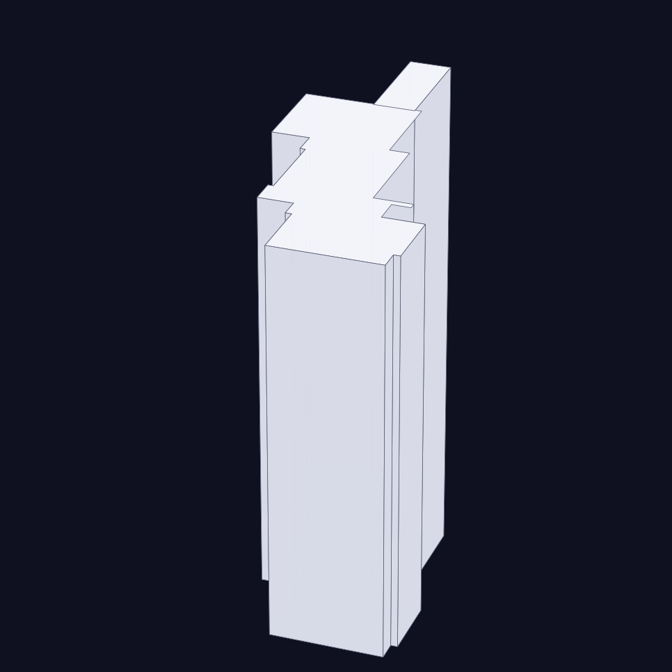
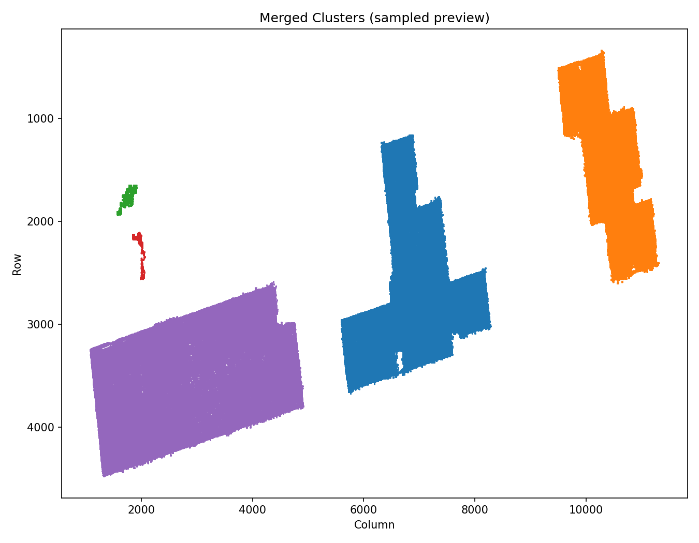

# 3D building reconstruction

This repository contains a two-step workflow for reconstructing 3D building geometry from remote sensing data. The pipeline uses an orthophoto and a point cloud as input, extracts candidate building footprints, estimates building structure, and exports geometry for 3D building reconstruction and CityGML-style outputs.

## Inputs

- Orthophoto imagery
- Point cloud data

## Workflow

- `Step1/`: point-cloud preprocessing, building/non-building separation, outlier removal, and cluster extraction.
- `Step2/`: building image extraction, line detection, candidate box generation, 3D frame generation, and CityGML export.

## Results

### 3D reconstruction preview

### Candidate box extraction on orthophoto

### Footprint cluster preview

## Quantitative Evaluation

Suseo area footprint extraction results:

| Model | Area | Precision | Recall | F1 | IoU |
| --- | --- | ---: | ---: | ---: | ---: |
| UNet | Suseo area | 0.637 | 0.842 | 0.725 | 0.569 |
| SegNet | Suseo area | 0.706 | 0.943 | 0.807 | 0.677 |
| GCN | Suseo area | 0.637 | 0.822 | 0.718 | 0.560 |
| UperNet | Suseo area | 0.691 | 0.907 | 0.785 | 0.646 |
| VGG16_UNet | Suseo area | 0.621 | 0.905 | 0.736 | 0.583 |
| UNet-Resnet | Suseo area | 0.626 | 0.856 | 0.723 | 0.566 |
| Our (tau_h = 15 m) | Suseo area | 0.962 | 0.848 | 0.902 | 0.821 |
| Our (tau_h = 10 m) | Suseo area | 0.944 | 0.849 | 0.905 | 0.810 |
| Our (tau_h = 5 m) | Suseo area | 0.917 | 0.906 | 0.911 | 0.838 |
| Our (tau_h = 3 m) | Suseo area | 0.873 | 0.978 | 0.922 | 0.857 |

## Repository Scope

Only the project code and lightweight documentation assets are tracked. Large datasets, model weights, and generated experiment outputs are intentionally excluded from Git history.
